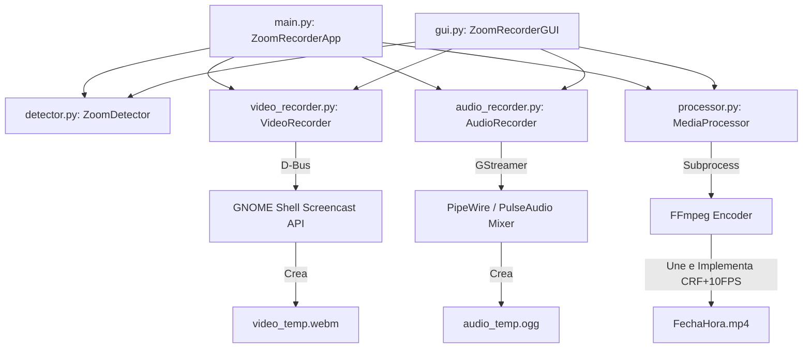

# Documento de Definición del Proyecto: Auto-Grabador de Zoom

Este documento detalla los requerimientos, especificaciones de diseño y las decisiones de ingeniería adoptadas para el desarrollo del script automatizado de grabación para Zoom en Linux.

---

## 🎯 Objetivo del Proyecto
Crear un sistema híbrido que ofrezca dos modos de operación seleccionables al inicio de la aplicación o mediante banderas por consola:

1.  **Modo Daemon Automático (Zoom)**: Monitorea de forma autónoma el estado de Zoom mediante la inspección ligera de ventanas X11 y, al detectar que el usuario entra en una llamada, inicia de inmediato la grabación de la pantalla completa combinando el audio del micrófono y el monitor de altavoces. Detiene y procesa la grabación automáticamente cuando la llamada finaliza.
2.  **Modo Grabación Manual (Pantalla Completa)**: Permite iniciar de forma manual e inmediata la grabación de la pantalla completa y el audio mixto del sistema en cualquier momento (independientemente de Zoom), finalizando y guardando el archivo de forma segura cuando el usuario presiona la tecla `ENTER` o interrumpe el script.

En ambos modos, la aplicación aplica un perfil de post-procesado de máxima compresión y nitidez para optimizar el peso de almacenamiento del archivo de salida final (`AAAAMMDD_HHMM.mp4`).

---

## 📑 Requerimientos de Negocio y Técnicos

### 1. Detección y Control de Ciclo de Vida
*   **Inicio Automático**: Empezar la grabación de forma transparente cuando el usuario inicie o se una a una llamada de Zoom.
*   **Corte Automático**: Detener las grabaciones inmediatamente después de que finalice la llamada de Zoom.
*   **Gestión Segura**: Si el script es interrumpido manualmente por el usuario (`SIGINT`/`Ctrl+C`), debe forzar el guardado y compresión de la parte grabada para evitar pérdida de datos.

### 2. Nombres de Archivos
*   El nombre del archivo final guardado debe seguir estrictamente la convención de fecha y hora local del momento del guardado: `AAAAMMDD_HHMM.mp4` (Ejemplo: `20260609_2155.mp4`).

### 3. Máxima Compresión y Claridad
*   **Legibilidad**: El vídeo comprimido debe conservar nitidez absoluta en textos pequeños, imágenes y código fuente compartidos en pantalla.
*   **Tamaño Mínimo**: Optimizar los parámetros de codificación para evitar tasas de bits (bitrate) innecesarias en momentos donde la pantalla permanece mayormente estática.

### 4. Estructura de Código (POO)
*   Uso estricto del paradigma de Programación Orientada a Objetos (POO).
*   Modularidad en múltiples archivos pequeños para evitar archivos extensos y mejorar la mantenibilidad.

---

## 🏗️ Decisiones de Ingeniería y Arquitectura

Para abordar las restricciones de seguridad impuestas por los entornos modernos basados en **Wayland**, se tomaron las siguientes decisiones arquitectónicas:

### Captura de Vídeo bajo Wayland
*   **Decisión**: Usar la API D-Bus nativa de GNOME Shell (`org.gnome.Shell.Screencast`).
*   **Por qué**: Herramientas antiguas como `ffmpeg -f x11grab` fallan o producen pantallas en negro bajo Wayland. El Portal XDG estándar muestra popups de consentimiento cada vez que se arranca. La API de GNOME Shell es privilegiada, silenciosa y altamente eficiente ya que captura directamente los búferes del compositor Mutter de GNOME.

### Mezcla y Captura de Audio
*   **Decisión**: Utilizar un pipeline de GStreamer con capturador `pulsesrc` y mezclador `audiomixer`.
*   **Por qué**: Zoom reproduce el sonido en los altavoces (salida del sistema) y lee del micrófono (entrada del sistema). Capturar uno solo perdería la mitad de la conversación. GStreamer nos permite:
    1.  Escanear dinámicamente los dispositivos de entrada y salida con la API `GstDeviceMonitor`.
    2.  Instanciar fuentes separadas para el micrófono y la pista monitor de altavoces.
    3.  Mezclar ambas pistas a nivel de flujo de audio en tiempo real y codificarlas de forma ligera directamente a Opus comprimido en un archivo Ogg.

### Estrategia de Compresión Extremadamente Eficiente
Dado que el objetivo es capturar reuniones de Zoom (texto, rostros y diapositivas estáticas en su mayoría) con el menor peso posible, se parametrizó FFmpeg en la fase de mezcla con el siguiente perfil de codificación:

| Parámetro | Valor | Justificación Técnica |
| :--- | :--- | :--- |
| **FPS del Vídeo** | `10 fps` | Reducir el frame rate de 30 a 10 elimina 20 fotogramas repetidos por segundo. En presentaciones estáticas, ahorra hasta un 70% de espacio sin degradar la visualización del texto. |
| **Códec de Vídeo** | `libx264` | Compatibilidad universal con navegadores, dispositivos móviles y reproductores. |
| **Calidad (CRF)** | `24` | El factor CRF 24 ofrece un equilibrio perfecto. En fotogramas estáticos reduce el bitrate casi a cero, y eleva la tasa de bits solo cuando hay movimiento (gesticulación o scroll). |
| **Ajuste de Códec** | `stillimage` | Optimiza H.264 específicamente para diapositivas e imágenes fijas reduciendo los artefactos de compresión alrededor de bordes de textos pequeños. |
| **Velocidad Preset** | `slow` | Permite al codificador tomarse más ciclos de CPU para compactar mejor el archivo final tras finalizar la llamada. |
| **Códec de Audio** | `AAC a 96 kbps` | El audio de voz no requiere alta fidelidad musical. 96kbps en AAC mantiene calidad de voz excelente con un peso insignificante. |
