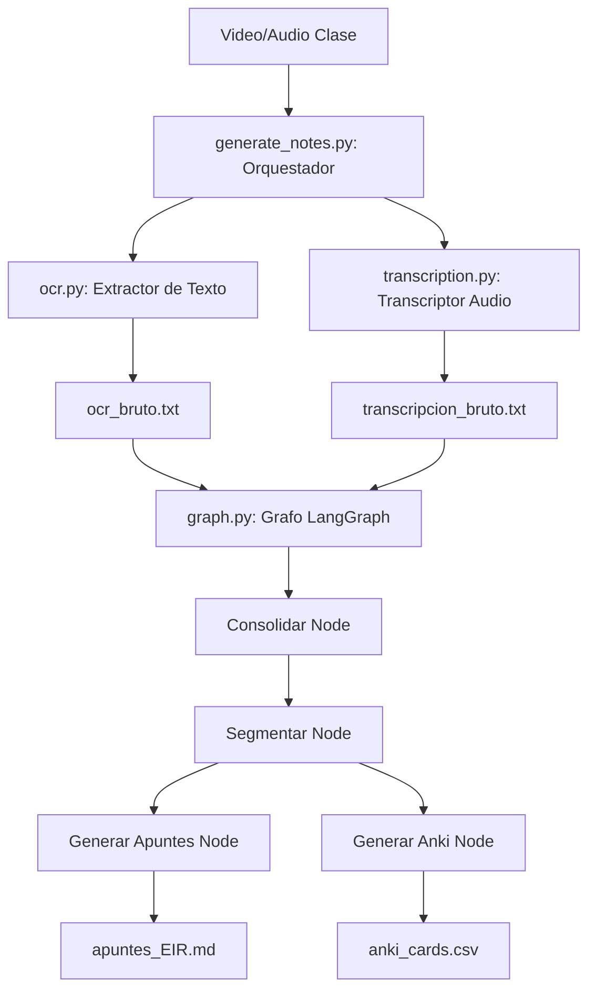

# Resumen del Trabajo Realizado: Pipeline EIR de Apuntes y Tarjetas Anki

Este documento detalla todas las implementaciones, optimizaciones de arquitectura y configuraciones realizadas en la herramienta de automatización para generar apuntes EIR estructurados y tarjetas Anki a partir de grabaciones de clase en vídeo.

---

## 1. 🛠️ Preparación y Dependencias del Entorno

### Dependencias del Sistema
*   **Gestores de Portapapeles**: Instalados `xclip`, `xsel` y `wl-clipboard` para solventar incompatibilidades de manipulación de texto en la terminal del sistema.
*   **Motor OCR**: Instalado `tesseract-ocr` junto con los paquetes de idioma en español (`tesseract-ocr-spa`) e inglés (`tesseract-ocr-eng`) para procesar las diapositivas de las grabaciones.

### Entorno Virtual (`.venv`)
*   Instaladas librerías de procesamiento de vídeo e imágenes: `opencv-python`, `pytesseract`.
*   Instalada la librería de transcripción neuronal optimizada: `faster-whisper`.
*   Instaladas librerías de orquestación de agentes e IA: `langgraph`, `langchain`, `langchain-openai`.

---

## 2. 🏗️ Arquitectura de Código del Pipeline

El proyecto está estructurado dentro de la carpeta `pipeline/` y cuenta con un test de validación en la raíz:

### 📄 Descripción de Módulos

1.  **[ocr.py](file:///home/cristina/Documentos/grabarPantalla/pipeline/ocr.py)**:
    *   **Extracción de Diapositivas**: Captura fotogramas del vídeo usando OpenCV.
    *   **Filtrado Horizontal (Crop)**: Recorta automáticamente el 25% derecho de la pantalla para excluir el chat de Zoom/Webinar de las lecturas.
    *   **Limpieza de UI de Zoom**: Implementa expresiones regulares para omitir líneas de controles flotantes (como *"Audio Settings"*, *"Chat"*, *"Levantar la mano"*), avisos de colapso de Zoom o firmas del profesor.
    *   **Salto Rápido (Seek)**: Optimiza la lectura de fotogramas saltando directamente a los intervalos de muestreo (15s) en lugar de leer secuencialmente cada frame.
    *   **Detección de Cambio de Diapositiva por Miniaturas**: Compara una versión reducida de 16x16 píxeles de fotogramas sucesivos para evitar llamar a Tesseract si el contenido de la diapositiva es estático.
2.  **[transcription.py](file:///home/cristina/Documentos/grabarPantalla/pipeline/transcription.py)**:
    *   **Procesador Whisper**: Transcribe el audio con `faster-whisper` en CPU mediante cuantización `int8` (alta velocidad, bajo consumo) y filtro VAD de silencios.
    *   **Estrategia de Troceado de Audio (Anti-OOM)**: Divide archivos de audio extremadamente largos en bloques secuenciales de 30 minutos mediante `ffmpeg` sin re-codificación (instantáneo). Esto mantiene el uso de memoria RAM por debajo de 1 GB, impidiendo que el cgroup o el OOM-killer de Linux maten el proceso (error 137).
3.  **[prompts.py](file:///home/cristina/Documentos/grabarPantalla/pipeline/prompts.py)**:
    *   Módulo exclusivo de constantes Python que almacena las plantillas de prompts de cada fase (Consolidación, Segmentación, Apuntes y Anki).
    *   **Filtro Anti-Alucinaciones**: Instrucciones estrictas que impiden a la IA inventarse códigos NANDA/NIC/NOC o escalas de enfermería si no se han mencionado explícitamente en la lección (rellenándolos con *"No mencionado en clase"*).
    *   **Tablas Markdown**: Directivas para formatear clasificaciones y escalas en tablas limpias separadas por líneas vacías para compatibilidad visual con Obsidian.
4.  **[graph.py](file:///home/cristina/Documentos/grabarPantalla/pipeline/graph.py)**:
    *   Define el grafo lógico de procesamiento usando LangGraph.
    *   Combina de forma paralela las ramas de redacción de apuntes finales y generación de flashcards CSV de Anki.
5.  **[generate_notes.py](file:///home/cristina/Documentos/grabarPantalla/pipeline/generate_notes.py)**:
    *   Orquestador principal que limpia nombres de archivos (deduce títulos y asignaturas), divide y ejecuta el grafo sobre tramos de tiempo para clases de 5 horas.
    *   Realiza una **fase final de revisión y optimización editorial (Refinement Pass)** llamando al LLM para unificar los bloques, eliminar redundancias y estructurar el cuestionario final.
    *   Deduplica automáticamente las tarjetas de Anki.
    *   Almacena los ficheros de texto bruto en `apuntes/bruto/`.
6.  **[handwritten_notes.py](file:///home/cristina/Documentos/grabarPantalla/pipeline/handwritten_notes.py)**:
    *   Orquestador para la digitalización de fotografías de apuntes manuscritos.
    *   Aplica preprocesamiento de imagen OpenCV (ecualización de contraste CLAHE) y extracción OCR multilingüe.
    *   Invoca al LLM mediante el prompt `HANDWRITTEN_TRANSCRIPTION_PROMPT` aplicando una **política de cero invención** y maquetación gráfica fiel (diagramas Mermaid, tablas Markdown y notación matemática LaTeX).
7.  **[test_handwritten_pipeline.py](file:///home/cristina/Documentos/grabarPantalla/test_handwritten_pipeline.py)**:
    *   Suite de pruebas unitarias que valida la extracción OCR y generación de Markdown desde imágenes manuscritas.

---

## 3. ⚙️ Seguridad y Configuración
*   **[pipeline_config.py](file:///home/cristina/Documentos/grabarPantalla/pipeline_config.py)**: Archivo seguro donde se almacenan las credenciales sensibles del servidor compatible con OpenAI (`https://leria.gal/api`, API Key, Modelo `leria:redacta`) y parámetros de tamaño de chunk (`OCR_CHUNK_MINUTES = 30`).
*   **[.gitignore](file:///home/cristina/Documentos/grabarPantalla/.gitignore)**: Configurado para omitir directorios de entornos virtuales, archivos temporales `.temp/` y el archivo `pipeline_config.py` para evitar fugas de tokens en repositorios.

---

## 4. 📝 Nueva Vía de Trabajo: Apuntes Manuscritos
*   **Prompt de Transcripción Fiel (`HANDWRITTEN_TRANSCRIPTION_PROMPT`)**: Prohíbe estrictamente deducir o añadir explicaciones externas no presentes en las fotos manuscritas.
*   **Integración en GUI GTK 3**: Añadida la pestaña **Pestaña 3: Manuscritos** en [gui.py](file:///home/cristina/Documentos/grabarPantalla/gui.py) para seleccionar múltiples fotografías, procesarlas en segundo plano y notificar el progreso.

